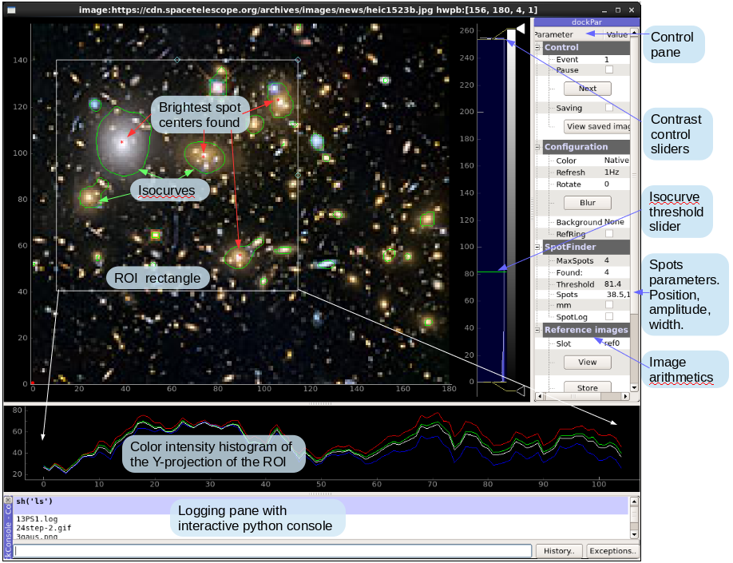

# Imagin
Interactive Viewer/Analyzer for streamed images or files based on python, pyqtgraph and scipy.

Features:
+ Input source: 
    * File system, 
    * HTTP link to image,
    * EPICS PV (requires pyepics),
    * Local USB cameras (requires openCV).
+ Default image format is PNG, other formats supported as well.
+ 16+ bit/channel images supported.
+ Image orientation and rotation.
+ Interactive zooming, panning, rotation.
+ Contrast/Coloration control.
+ Region Of Interest (ROI) for image analysis.
+ ROI partitioning. 
+ ROI projection plots.
+ Isocurves. The isocurve level defines the threshold for object finding.
+ Fast and robust characterization of multiple objects using fitted ellipsoids.
+ Gaussian (1D and 2D) fit for improved precision.
+ Effective de-speckling.
+ Interactive calibration of pixels to millimeters.
+ Reference Images: save/retrieve image to/from a reference slots.
+ Background subtraction using a reference image.
+ Easy extentable using with user-suplied add-ons.
+ Fast browsing/cleanup of image directories.
+ Interactive python console with access to image data, graphics objects and shell.

[Presentation](../master/Slides_from_ICALEPCS-2019.pdf)
## Try:
    python imagin.py

