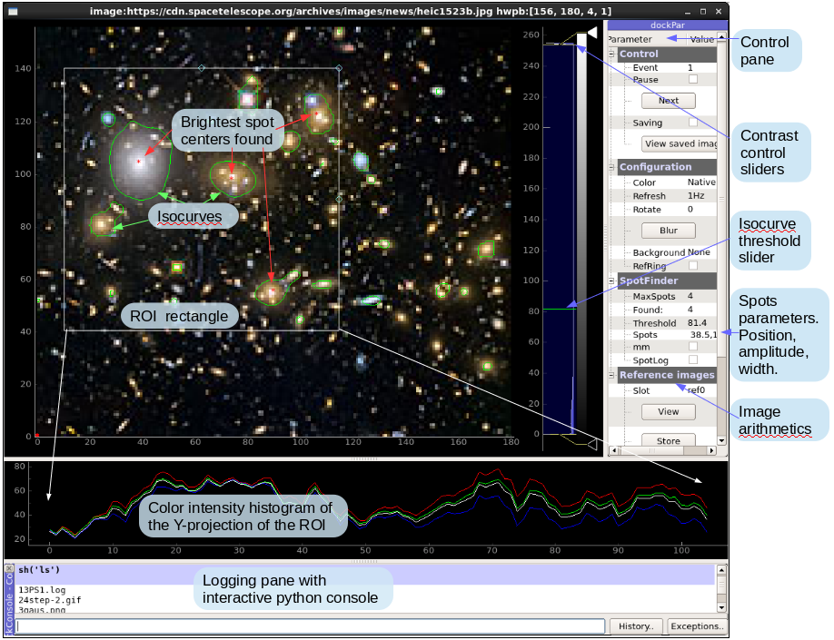

# Imagin. (Beta release).

Imagin is an interactive viewer and analyzer for streamed images and image files, built with Python, pyqtgraph, and SciPy.

## Features

- Input sources:
  - file system
  - HTTP image URLs
  - EPICS Channel Access
  - EPICS PVAccess
  - USB cameras
- PNG is the default image format; other formats are also supported.
- Supports images with 16-bit or higher channel depth.
- Image orientation control and arbitrary rotation.
- Interactive zooming and panning.
- Contrast and color-map control.
- Region of interest (ROI) selection for image analysis.
- ROI partitioning.
- ROI projection plots.
- Isocurves, with the isocurve level used as the threshold for object detection.
- Fast, robust characterization of multiple objects using fitted ellipsoids.
- Optional Gaussian fitting in 1D or 2D for improved precision.
- De-speckling.
- Automatic background elimination using prominence filtering (de-base).
- Background subtraction using reference images.
- Interactive calibration from pixels to millimeters.
- Reference image slots for saving and restoring images.
- Extensible through user-supplied add-ons.
- Fast browsing and cleanup of image directories.
- Interactive Python console with access to image data, graphics objects, and the shell.



[Presentation](docs/Slides_from_ICALEPCS-2019.pdf)

## Examples

```bash
python -m imagin -b file sample_images/*.jpg -t 100 -m 40
python -m imagin -b file ~/Pictures/*.png

```
### Testing with EPICS PVAccess image simulator epicsdev.imagegen:
```bash
pip install epicsdev
python -m epicsdev.imagegen&
python -m imagin -b pva -t 100 image0:image
```
Animate by changing image parameters from a python script:
```python
import time, numpy as np
from p4p.client.thread import Context
iface = Context('pva')

oneTo0 = 1 - np.linspace(0,1,11)
scales = np.append(oneTo0[:-1], np.flip(oneTo0)[2:])
for scale in scales:
    iface.put('image0:gridScaleX',scale)
    time.sleep(.1)```
```
### Testing with EPICS Channel Access
The simulated EPICS camera can be run from Docker:

https://hub.docker.com/r/klauer/simioc-docker

```bash
python3 setup_SimDetector.py
python3 -m imagin -b epics sim:det -m 16 -t 80
```
